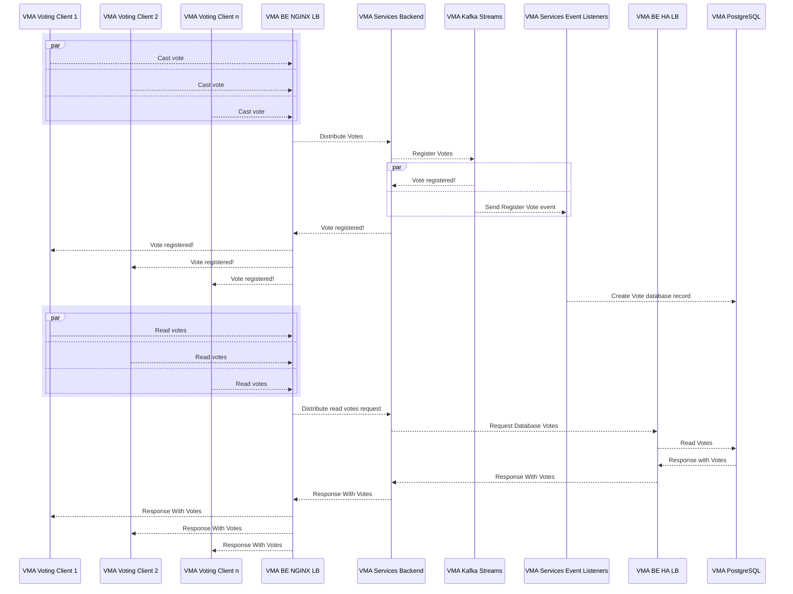

# vma-archiver

---

[](https://twitter.com/intent/tweet?text=%20Checkout%20this%20%40github%20repo%20by%20%40joaofse%20%F0%9F%91%A8%F0%9F%8F%BD%E2%80%8D%F0%9F%92%BB%3A%20https%3A//github.com/jesperancinha/vma-archiver)
[](https://github.com/jesperancinha/vma-archiver)
[](#)

[](https://circleci.com/gh/jesperancinha/vma-archiver)
[](https://ci.appveyor.com/project/jesperancinha/vma-archiver)
[](https://github.com/jesperancinha/vma-archiver/actions/workflows/vma-archiver.yml)

[](https://www.codacy.com/gh/jesperancinha/vma-archiver/dashboard?utm_source=github.com&amp;utm_medium=referral&amp;utm_content=jesperancinha/vma-archiver&amp;utm_campaign=Badge_Grade)
[](https://codebeat.co/projects/github-com-jesperancinha-vma-archiver-master)
[](https://travis-ci.com/jesperancinha/vma-archiver)
[](https://bettercodehub.com/results/jesperancinha/vma-archiver)
[](https://snyk.io/test/github/jesperancinha/vma-archiver)

[](https://coveralls.io/github/jesperancinha/vma-archiver?branch=master)
[](https://codecov.io/gh/jesperancinha/vma-archiver)
[](https://www.codacy.com/gh/jesperancinha/vma-archiver/dashboard?utm_source=github.com&utm_medium=referral&utm_content=jesperancinha/vma-archiver&utm_campaign=Badge_Coverage)

[](#)
[](#)
[](#)

---

## Technologies used

---

[](https://kotlinlang.org/)
[](https://spring.io/projects/spring-framework)
[](https://spring.io/projects/spring-boot)
[](https://docs.spring.io/spring-framework/docs/current/reference/html/web-reactive.html)
[](https://maven.apache.org/)
[](https://locust.io/)
[](https://www.postgresql.org/)
[](https://www.testcontainers.org/)


---

## Introduction

We are going to make a VMA archiver. VMA in this case does not stand for Video Music Archive anymore. That was version
0.0.0. It now stands for Video Music Awards. So we are going to make a service to register nominees and winners of a VMA
show. In this case, we'll use a fake MTV Awards Show. Instead of using contemporary music, we'll make an MTV awards with
music and artists from the 1920's.

Our application will be built around the Reactive CoRoutine Paradigms. We'll be using five important elements:
Hazelcast, SpringWebFlux, Flow, Kotlin Co-Routines and a nice architecture.

This repo is also the official support repo to my article on medium:

[](https://itnext.io/coroutines-distributed-cache-resilience-and-replication-in-kotlin-making-a-vmas-application-df563edf8fe8) [Coroutines, Distributed Cache, Resilience, and Replication in Kotlin — Making a VMA’s application](https://itnext.io/coroutines-distributed-cache-resilience-and-replication-in-kotlin-making-a-vmas-application-df563edf8fe8)

#### Walk through

<div align="center">
      <a title="Coroutines, Distributed Cache, Resilience, and Replication in Kotlin DEMO — A VMA’s application" href="https://www.youtube.com/watch?v=hNpEMOFkvv4">
     
      </a>
</div>

---

## Project Layout

-   [VMA Demo Generation](./vma-demo) - Generates The Demo Awards - It is customizable in terms of categories, music and
  artists.
-   [VMA Common](./vma-common) - A Common Library to support Spring Boot Startup Services.
-   [VMA Play](./vma-play) - A way to play with co-routines separated from the project. It has examples on the main and
  test directories.
-   [VMA Spring CoRoutine Reactive Service](./vma-service-backend) - The reactive service facing the front-end - It posts
  votes in Kafka, registers a new award show directly and reads voting results from the database.
-   [VMA Service Event Listener](./vma-service-event-listener) - Listens to incoming votes sent in a massive load fashion.
-   [Locust](./locust) - The location of locust service. It creates workers in kotlin that simulate random massive voters.

---

## Endpoints

-   [http://localhost:8080/api/vma/welcome](http://localhost:8080/api/vma/welcome)

---

## Install essential libraries and commands

```shell
make install
```

## How to start

```shell
make docker-clean-build-start
```

## Serving Spring Boot (LOCAL)

In order to let Kafka know where to get to locally you need to define locally that `jofisaes_vma_broker` is also
in `127.0.0.1`.

This is done in MAC-OS and Linux machines on `/etc/hosts`:

```text
127.0.0.1   jofisaes_vma_broker
```

---

## Knowledge Cloud

`BuildersKt.class`, `Builders.common`, `withContext`, `ifEmpty`, `tailrec`, `suspend`, `runBlocking`, `shuffled`
, `sortedBy`, `async`
, `await`, `launch`, `delay`, `runBlocking`, `coroutineScope`, `Channel`, `consumeEach`, `produce`, `produceSquares`
, `produceNumbers`, `yield`, `@Volatile`, `withContext`, `Dispatchers.Default`, `Mutex`, `CoroutineScope`
, `counterActor`, `override val`
`massiveRun`,

---

## Knowledge for Integration Tests Cloud

`@Mockk`, `@Test`, `@SpringBootTest`

---

## Java Setup

```shell
sdk install java 17-open
sdk use java 17-open
```

---

## Sequence diagram

To visualize this diagram you may need
the [mermaid-diagrams](https://chrome.google.com/webstore/detail/mermaid-diagrams/phfcghedmopjadpojhmmaffjmfiakfil)
plugin installation.

To visualize it in Intellij, please install the [mermaid plugin](https://mermaid-js.github.io/mermaid/#/).



---

## References

-   [Using Kotlin Coroutines with Spring](https://hantsy.medium.com/using-kotlin-coroutines-with-spring-d2784a300bda)
-   [Going Reactive with Spring, Coroutines and Kotlin Flow](https://spring.io/blog/2019/04/12/going-reactive-with-spring-coroutines-and-kotlin-flow)
-   [How to Set Up PostgreSQL Cluster using Patroni on Ubuntu 20.04](https://snapshooter.com/learn/postgresql/postgresql-cluster-patroni)
-   [Creating a single HAProxy and two Apache containers with Docker compose](http://www.inanzzz.com/index.php/post/w14j/creating-a-single-haproxy-and-two-apache-containers-with-docker-compose?ref=morioh.com&utm_source=morioh.com)
-   [HAProxy - The Reliable, High Performance TCP/HTTP Load Balancer](https://hub.docker.com/_/haproxy)
-   [Ingress Gateways](https://istio.io/latest/docs/tasks/traffic-management/ingress/ingress-control/)
-   [Amazon Aurora connection management](https://docs.aws.amazon.com/AmazonRDS/latest/AuroraUserGuide/Aurora.Overview.Endpoints.html)
-   [PostgreSQL Load Balancing with HAProxy](https://severalnines.com/resources/database-management-tutorials/postgresql-load-balancing-haproxy)
-   [PostgreSQL HAProxy: Proxy for HA and Load Balance](https://www.alibabacloud.com/blog/postgresql-haproxy-proxy-for-ha-and-load-balance_597618)
-   [How Does a Database Load Balancer Work?](https://severalnines.com/database-blog/how-does-database-load-balancer-work)
-   [HTTP Load Balancing](https://docs.nginx.com/nginx/admin-guide/load-balancer/http-load-balancer/)
-   [Using nginx as HTTP load balancer](http://nginx.org/en/docs/http/load_balancing.html)
-   [Markdown Badges](https://github.com/Ileriayo/markdown-badges)
-   [Kotlin coroutines on Android](https://developer.android.com/kotlin/coroutines)
-   [Full Kotlin Coroutines Design Reference](https://kotlin.github.io/kotlinx.coroutines/)
-   [Kotlin Coroutines Design Document](https://github.com/Kotlin/KEEP/blob/master/proposals/coroutines.md)
-   [Guide to UI programming with coroutines](https://github.com/Kotlin/kotlinx.coroutines/blob/master/ui/coroutines-guide-ui.md)
-   [Coroutine Channels](https://kotlinlang.org/docs/channels.html)
-   [Coroutine](https://en.wikipedia.org/wiki/Coroutine)
-   [Best practices for coroutines in Android](https://developer.android.com/kotlin/coroutines/coroutines-best-practices)
-   [Imagining your Repository Layer with Coroutines](https://proandroiddev.com/imagining-your-repository-layer-with-coroutines-7ee052ee4caa)
-   [17.5. Coroutines](https://docs.spring.io/spring-data/r2dbc/docs/current/reference/html/#reference)
-   [17.5.2. How Reactive translates to Coroutines?](https://docs.spring.io/spring-data/r2dbc/docs/current/reference/html/#kotlin.coroutines.reactive)

## Buy me a coffee

I hope you enjoyed this repository. If you did, you can optionally please buy me a coffee, which supports me in constantly improve and make new free content regularly for everyone. Thank you so much!

[](https://www.buymeacoffee.com/jesperancinha)

## About me 👨🏽‍💻🚀🏳️‍🌈

[](http://joaofilipesabinoesperancinha.nl)
[](https://medium.com/@jofisaes)
[](https://www.credly.com/users/joao-esperancinha)
[](https://joaofilipesabinoesperancinha.nl/)
[](https://github.com/jesperancinha)
[](https://twitter.com/joaofse)
[](https://github.com/JEsperancinhaOrg)   
[](https://github.com/jesperancinha/project-signer/blob/master/project-signer-templates/Articles.md)
[](http://itf.joaofilipesabinoesperancinha.nl/)
[](https://joaofilipesabinoesperancinha.nl/badges)
[](https://github.com/jesperancinha/project-signer/blob/master/project-signer-quality/Build.md)
[](https://www.coursera.org/user/da3ff90299fa9297e283ee8e65364ffb)
[](https://play.google.com/store/apps/developer?id=Joao+Filipe+Sabino+Esperancinha)   
[](https://search.maven.org/search?q=org.jesperancinha)
[](https://hub.docker.com/u/jesperancinha)
[](https://stackoverflow.com/users/3702839/joao-esperancinha)
[](https://www.reddit.com/user/jesperancinha/)
[](https://dev.to/jofisaes)
[](https://hackernoon.com/@jesperancinha)
[](https://www.codeproject.com/Members/jesperancinha)
[](https://github.com/jesperancinha)
[](https://bitbucket.org/jesperancinha)
[](https://gitlab.com/jesperancinha)
[](https://bintray.com/jesperancinha)
[](https://www.freecodecamp.org/jofisaes)
[](https://www.hackerrank.com/jofisaes)
[](https://codeforces.com/profile/jesperancinha)
[](https://coderbyte.com/profile/jesperancinha)
[](https://www.codewars.com/users/jesperancinha)
[](https://codepen.io/jesperancinha)
[](https://news.ycombinator.com/user?id=jesperancinha)
[](https://www.infoq.com/profile/Joao-Esperancinha.2/)
[](https://www.linkedin.com/in/joaoesperancinha/)
[](https://www.xing.com/profile/Joao_Esperancinha/cv)
[](https://jofisaes.tumblr.com/)
[](https://nl.pinterest.com/jesperancinha/)
[](https://nl.quora.com/profile/Jo%C3%A3o-Esperancinha)

## Achievements

[](https://www.credly.com/badges/762fa7a4-9cf4-417d-bd29-7e072d74cdb7)
[](https://www.credly.com/badges/27a14e06-f591-4105-91ca-8c3215ef39a2)
[](https://www.credly.com/badges/87609d8e-27c5-45c9-9e42-60a5e9283280)
[](https://www.credly.com/badges/ad1f4abe-3dfa-4a8c-b3c7-bae4669ad8ce)
[](https://cancanit.com/certified/1462/)
[](https://graphacademy.neo4j.com/certificates/c279afd7c3988bd727f8b3acb44b87f7504f940aac952495ff827dbfcac024fb.pdf)
[](https://www.credly.com/badges/8d27e38c-869d-4815-8df3-13762c642d64)
